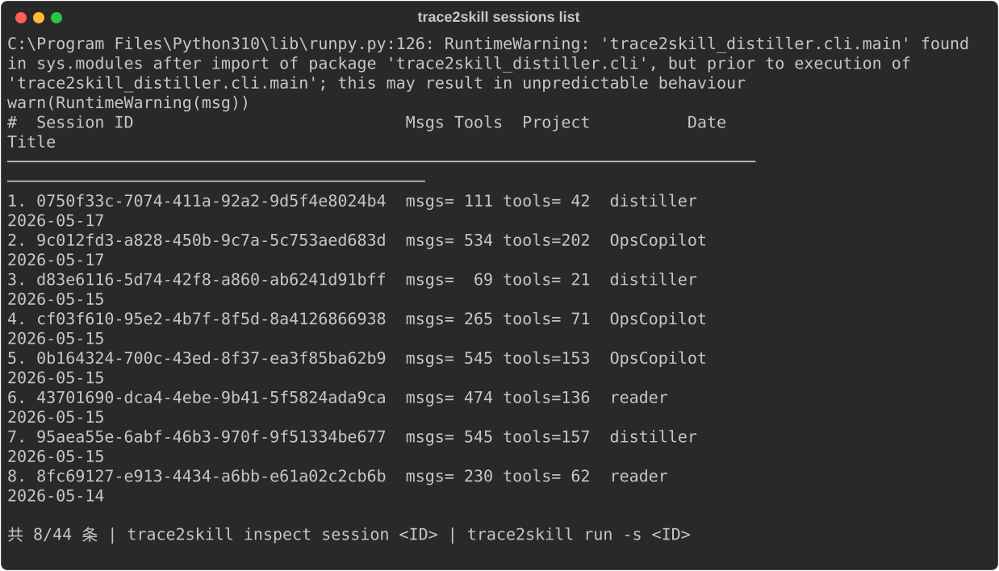
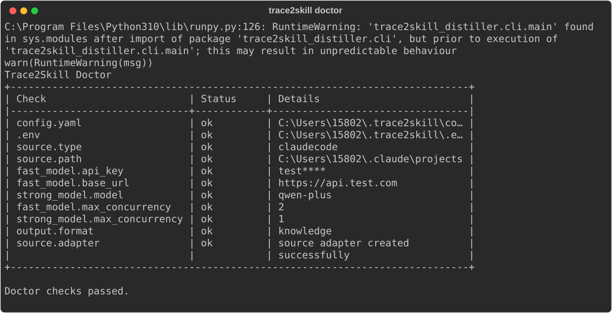
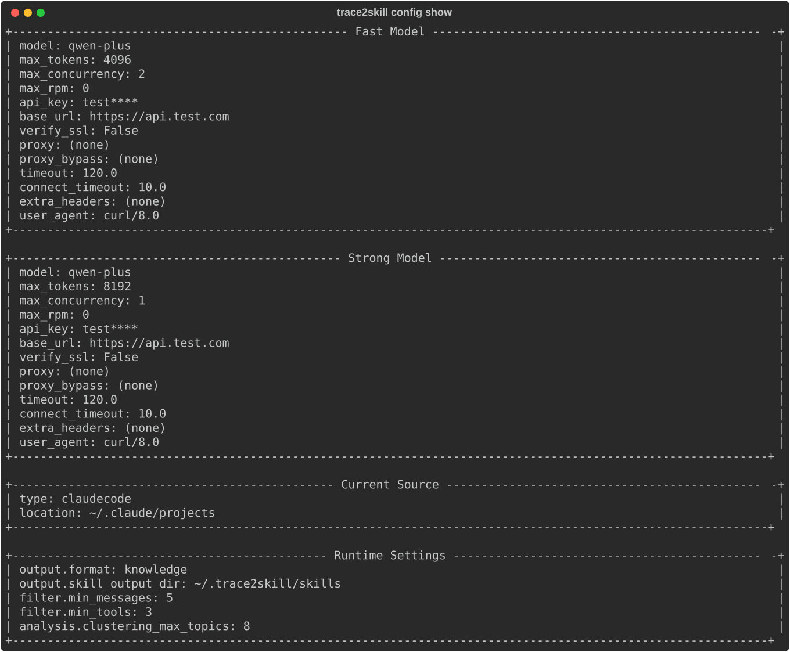
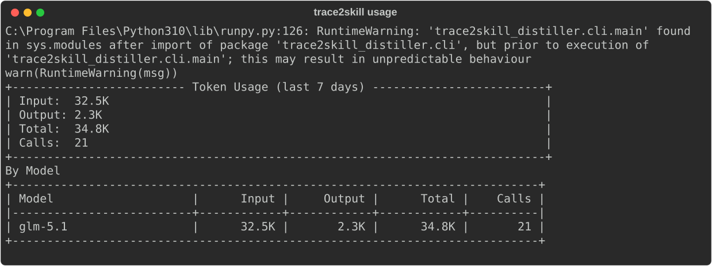
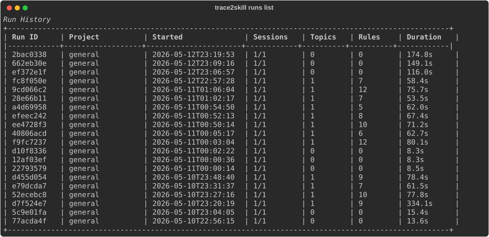
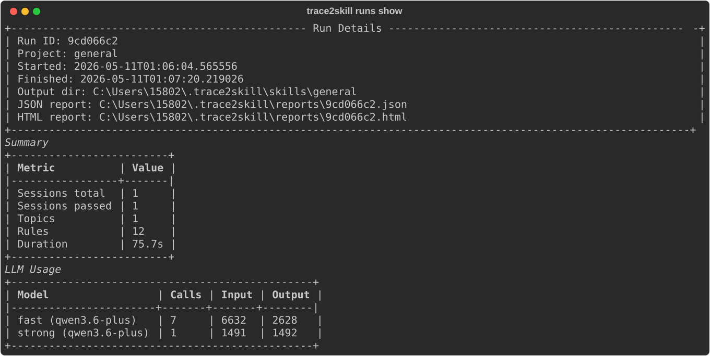

# Trace2Skill Distiller

**从 AI 编程会话中自动提炼可复用的技能知识。**

分析你的 AI 编程会话记录（支持 [OpenCode](https://github.com/opencode-ai/opencode)、Chrys、[CodeAgent](https://github.com/NgAgent/codeagent)、[Claude Code](https://claude.ai/code)），用 LLM 提取可操作的实践经验和技能规则，写入 `SKILL.md` 供 AI 编程助手自动发现和复用。

## 设计理念

AI 编程助手每天都在帮你写代码、调 Bug、做调研——但交互经验随会话结束而消散。同样的坑踩两次、同样的配置步骤重复摸索。

本项目灵感来自 **Trace2Skill** ([Ni et al., 2026](https://arxiv.org/abs/2603.25158))：让 LLM 分析执行轨迹，从中蒸馏可迁移的技能。核心发现：**用自然语言存储技能（不需要微调），小模型提取的技能就能让大模型性能提升数十个百分点。**

## 处理流水线

```
OpenCode / Chrys / CodeAgent / Claude Code 会话历史
       │
       ▼
┌──────────────────────────────────────────────┐
│  数据采集 (mining/)                           │
│                                               │
│  L0  智能压缩 — bash→命令+关键行, read→路径+行数 │
│  L1  快速LLM — 意图边界检测 + 逐块结构化提取   │
│  L2  快速LLM — 会话级聚合 → TrajectorySummary │
└───────────────────┬──────────────────────────┘
                    │
                    ▼
┌──────────────────────────────────────────────┐
│  数据分析 (analysis/)                         │
│                                               │
│  Step 1.5  主题聚类 — 按技术主题分组相似轨迹    │
│  Step 2    技能蒸馏 — 强LLM提炼技能规则+正文   │
└───────────────────┬──────────────────────────┘
                    │
                    ▼
┌──────────────────────────────────────────────┐
│  结果输出 (output/)                           │
│                                               │
│  SKILL.md 技能文件 + _index.md 索引            │
│  HTML 蒸馏报告 + 增量状态持久化                │
└──────────────────────────────────────────────┘
```

### 双模型架构

| 角色 | 用途 | 调用频率 |
|------|------|----------|
| **fast** | 预处理、意图检测、聚类 | 每会话 3-5 次 |
| **strong** | 技能蒸馏、内容合并 | 每主题 1 次 |

便宜模型做大量预处理，只在蒸馏阶段用强模型，控制成本。

## 架构

四模块独立架构，通过 Protocol 接口解耦，依赖方向严格单向：

```
              ┌─────────────┐
              │    core/     │  配置 + 枚举 + 工具（零依赖）
              └──────┬──────┘
                     │
              ┌──────┴──────┐
              │    llm/      │  LLM 接驳（Provider 协议 + 高层 Client）
              └──────┬──────┘
                     │
        ┌────────────┼────────────┐
        ▼            ▼            ▼
  ┌───────────┐ ┌───────────┐ ┌───────────┐
  │ mining/   │ │ analysis/ │ │  output/   │
  │ 数据采集  │ │ 数据分析  │ │  结果输出  │
  └─────┬─────┘ └─────┬─────┘ └─────┬─────┘
        │             │             │
        └─────────────┼─────────────┘
                      ▼
              ┌───────────────┐
              │ orchestrator/ │  组合四大模块
              └───────┬───────┘
                      ▼
              ┌───────────────┐
              │    cli/       │  Click 薄壳
              └───────────────┘
```

**依赖规则**：
- `core` → 无依赖
- `llm` → core
- `mining` → llm, core
- `analysis` → mining.types, llm, core
- `output` → analysis.types, mining.types, llm, core
- 无循环，无反向依赖

### 扩展点

每个模块通过 Protocol 定义接口，替换实现只需实现对应 Protocol：

| 模块 | Protocol | 当前实现 | 可扩展为 |
|------|----------|----------|----------|
| LLM 接驳 | `LLMProvider` | `OpenAICompatibleProvider` (httpx) | Anthropic、Azure、自定义 HTTP |
| 数据采集 | `SessionSource` | `OpenCodeSource` (SQLite)、`ChrysSource` (JSON)、`CodeAgentSource` (SQLite)、`ClaudeCodeSource` (JSONL) | 其他 Coding Agent |
| 聚类策略 | `ClusterStrategy` | `SemanticClusterStrategy` (LLM) | Embedding 向量聚类、关键词匹配 |
| 蒸馏策略 | `DistillationStrategy` | `LLMDistillationStrategy` | 代码审查分析、架构决策提取 |
| 技能格式 | `SkillFormatter` | `SkillMdFormatter` (SKILL.md) | JSON、Confluence Wiki |
| 报告展示 | `ReportPresenter` | `HtmlReportPresenter` | 终端 Rich、Markdown |

## 安装

要求 Python >= 3.10。

### 方式一：从 Release 安装（推荐）

从 [GitHub Releases](https://github.com/Tudou77826/trace2skill_distiller/releases) 下载最新 `.whl` 文件：

```bash
pip install trace2skill_distiller-0.1.0-py3-none-any.whl
trace2skill init
```

### 方式二：从源码安装

```bash
git clone https://github.com/Tudou77826/trace2skill_distiller.git
cd trace2skill_distiller
uv sync
trace2skill init
```

### 初始化配置

```bash
# 交互式（推荐）
trace2skill init

# 或命令式指定：
trace2skill init \
  --api-key "your-api-key" \
  --base-url "https://api.example.com/v1" \
  --source "opencode" \
  --fast-model "gpt-4o-mini" \
  --strong-model "gpt-4o" \
  --fast-concurrency 4 \
  --strong-concurrency 2 \
  --output-format "skill_md"

# 可选：代理、超时等
trace2skill init \
  --api-key "your-api-key" \
  --base-url "https://api.example.com/v1" \
  --proxy "socks5://127.0.0.1:1080" \
  --proxy-bypass "localhost,127\\.0\\.0\\.1" \
  --timeout 180 \
  --connect-timeout 10 \
  --no-verify-ssl
```

需要 SOCKS 代理时安装 `httpx[socks]`：`pip install "httpx[socks]"`（源码安装则为 `uv add "httpx[socks]"`）。

### 支持的数据源

| 数据源 | 配置类型 | 数据位置 | 说明 |
|--------|----------|----------|------|
| OpenCode | `opencode` | `~/.local/share/opencode/opencode.db` | SQLite + CLI export |
| Chrys | `chrys` | 自动探测或指定目录 | JSON 文件 |
| CodeAgent | `codeagent` | `~/.local/share/opencode/db/ngagent.db` | SQLite 直接读取 |
| Claude Code | `claudecode` | `~/.claude/projects/` | JSONL 文件 |

## 使用

### 效果预览

<p align="center"><code>trace2skill sessions list</code></p>
<p align="center"></p>

<p align="center"><code>trace2skill doctor</code></p>
<p align="center"></p>

<p align="center"><code>trace2skill config show</code></p>
<p align="center"></p>

<p align="center"><code>trace2skill usage</code></p>
<p align="center"></p>

<p align="center"><code>trace2skill runs list</code>&nbsp;&nbsp;/&nbsp;&nbsp;<code>trace2skill runs show &lt;id&gt;</code></p>
<p align="center">


</p>

### CLI 命令地图

```text
trace2skill
├── init
├── doctor
├── config
│   ├── show
│   ├── set <key> <value>
│   └── edit
├── sessions
│   ├── list [--project <name>] [--limit <n>] [--include-low-quality]
│   └── show <session-id>
├── inspect
│   ├── session <session-id>
│   └── run <run-id>
├── run
│   ├── [--project <name> | --session <id>]
│   ├── [--mode preprocess|analyze|full]
│   ├── [--output skill|knowledge]
│   └── [--preview]
├── runs
│   ├── list
│   └── show <run-id>
└── usage [--source <type>] [--days <n>] [--project <name>]
```

### 命令职责

| 命令 | 用途 |
|------|------|
| `trace2skill init` | 初始化配置文件和默认运行设置 |
| `trace2skill doctor` | 检查当前 source、模型、配置和路径是否可用 |
| `trace2skill config ...` | 查看或修改当前运行配置 |
| `trace2skill sessions list` | 列出当前 source 下可用会话 |
| `trace2skill sessions show <id>` | 查看单个会话的元信息和质量情况 |
| `trace2skill inspect session <id>` | 查看单个会话的预处理结果 |
| `trace2skill inspect run <id>` | 查看某次运行的详细摘要 |
| `trace2skill run ...` | 运行蒸馏流程 |
| `trace2skill runs list` | 查看历史运行列表 |
| `trace2skill runs show <id>` | 查看单次运行的统计、报告和输出信息 |
| `trace2skill usage` | 查看最近 N 天的 token 消耗统计 |

```bash
# 首次初始化
trace2skill init

# 检查当前配置、source 和模型设置
trace2skill doctor

# 查看当前 source 下可用会话
trace2skill sessions list
trace2skill sessions list --project my-project

# 查看单个会话元信息
trace2skill sessions show <session-id>

# 预览单个会话的预处理结果
trace2skill inspect session <session-id>

# 从当前 source 的指定项目提炼技能
trace2skill run --project my-project

# 指定单个会话
trace2skill run --session <session-id>

# 只做预处理
trace2skill run --project my-project --mode preprocess

# 只分析主题和规则，不写技能文件
trace2skill run --project my-project --mode analyze

# 预览模式：不写任何文件或状态
trace2skill run --project my-project --preview

# 查看历史运行
trace2skill runs list
trace2skill runs show <run-id>

# 查看 token 消耗统计
trace2skill usage --source opencode --days 30
trace2skill usage --source claudecode --days 7 --project my-project
```

### 配置管理

```bash
# 查看当前有效配置（API Key 脱敏）
trace2skill config show

# 设置单个配置项（点分路径 key）
trace2skill config set source.type chrys
trace2skill config set source.opencode.db_path "D:/data/opencode.db"
trace2skill config set fast.max_concurrency 4
trace2skill config set strong.max_concurrency 2
trace2skill config set output.format knowledge
trace2skill config set filter.min_messages 8

# 用编辑器直接修改配置文件
trace2skill config edit
```

CLI 默认始终使用配置里的当前 source、模型级并发限制和输出格式；运行时不会跨多种 coding 软件遍历。同名 `project` 只在当前 source 范围内解释。

并发现在只由模型配置控制：

- `fast.max_concurrency`：控制预处理阶段的并发上限
- `strong.max_concurrency`：控制蒸馏阶段的并发上限
- `max_rpm`：控制对应模型的每分钟请求上限
- 不再提供全局 `workers` 配置

每次非预览运行完成后生成 JSON + HTML 报告至 `~/.trace2skill/reports/`，包含会话筛选、主题分布、规则统计、LLM 开销等。

## 技能类型

蒸馏时 LLM 自动判断类型并选择对应的 Markdown 格式：

| 类型 | 说明 | 输出格式 |
|------|------|----------|
| `procedure` | 操作流程（安装、部署、配置） | 分步流程 + 注意事项 |
| `knowledge` | 业务理解（架构调研、项目结构） | 核心概念 + 关键关系 + 要点 |
| `checklist` | 注意事项（调试、安全） | MUST / WHEN→THEN / NEVER |
| `troubleshooting` | 调试排障 | 问题 → 排查路径 → 解决方案 |
| `reference` | 工具参考（配置项、API） | 配置表 + 示例 + 注意事项 |

## 输出示例

技能文件写入 `~/.trace2skill/skills/<project>/<topic-id>/SKILL.md`：

```markdown
---
name: opencode-setup
description: Install oh-my-opencode CLI with appropriate model flags.
    Use when deploying opencode, configuring user subscriptions,
    or enabling z.ai.codingplan sync.
---

# oh-my-opencode 自动化安装与订阅配置

## 步骤
1. **检查前置工具**：运行 `opencode --version`，确认版本兼容
2. **收集用户订阅信息**：获取是否订阅 Gemini、Claude、OpenAI 等模型
3. **构建安装命令**：根据结果拼装命令及标志
4. **执行安装**：运行命令，观察返回信息
5. **验证**：使用 `oh-my-opencode status` 检查状态

## 注意事项
- 订阅标志必须显式设置（yes/no），否则可能导致运行时错误
```

`description` 字段遵循 `[What it does]. Use when [scenario].` 格式，英文编写含触发词，AI Agent 可据此自动发现和匹配。

## 配置

`~/.trace2skill/config.yaml`：

```yaml
models:
  fast:
    model: "gpt-4o-mini"
    max_tokens: 4096
    max_concurrency: 4                          # 预处理并发上限
    max_rpm: 60                                 # 预处理每分钟请求上限，0 表示不限制
    proxy: "socks5://127.0.0.1:1080"          # 可选：代理地址
    proxy_bypass: "localhost,127\\.0\\.0\\.1"   # 可选：不走代理的 host 正则（逗号分隔）
    timeout: 120                               # 可选：请求超时（秒）
    connect_timeout: 10                        # 可选：连接超时（秒）
    verify_ssl: false                          # 可选：是否验证 SSL
    user_agent: "curl/8.0"                     # 可选：自定义 User-Agent
  strong:
    model: "gpt-4o"
    max_tokens: 8192
    max_concurrency: 2                          # 蒸馏并发上限
    max_rpm: 20                                 # 蒸馏每分钟请求上限，0 表示不限制

source:
  type: "opencode"                        # opencode | chrys | codeagent | claudecode
  opencode:
    db_path: "~/.local/share/opencode/opencode.db"
  chrys:
    sessions_dir: ""                        # 留空表示自动探测
  codeagent:
    db_path: "~/.local/share/opencode/db/ngagent.db"
  claudecode:
    projects_dir: "~/.claude/projects"

filter:
  min_messages: 5
  min_tools: 3

scheduler:
  enabled: false
  cron: "0 3 * * *"

output:
  format: "knowledge_md"
  skill_output_dir: "~/.trace2skill/skills"
  max_rules_per_skill: 15

clustering_max_topics: 8
```

环境变量覆盖（或写入 `~/.trace2skill/.env`）：

```bash
TRACE2SKILL_API_KEY=sk-xxx
TRACE2SKILL_BASE_URL=https://api.example.com/v1
TRACE2SKILL_FAST_MODEL=gpt-4o-mini
TRACE2SKILL_STRONG_MODEL=gpt-4o
TRACE2SKILL_VERIFY_SSL=true
TRACE2SKILL_PROXY=
```

## 项目结构

```
src/trace2skill_distiller/
├── core/                            # 共享基础
│   ├── config.py                    # DistillConfig + 子配置 (LLMConfig, AnalysisConfig, ...)
│   ├── console.py                   # 共享 Rich Console 单例
│   ├── types.py                     # Label, SkillType, RuleType 枚举
│   └── utils.py                     # estimate_tokens (CJK感知), truncate_to_token_budget
│
├── llm/                             # 模块 1：LLM 接驳
│   ├── base.py                      # Protocol: LLMProvider
│   ├── client.py                    # LLMClient (重试/JSON修复/token追踪/close)
│   ├── transport.py                 # ProxyBypassTransport (代理绕过路由)
│   ├── types.py                     # LLMResponse, LLMUsageStats
│   └── providers/
│       └── openai_compatible.py     # httpx 实现 (代理绕过/SSL/API key验证)
│
├── mining/                          # 模块 2：数据采集
│   ├── types.py                     # Session, TrajectorySummary, CleanedSession
│   ├── sources/
│   │   ├── base.py                  # Protocol: SessionSource
│   │   ├── opencode.py             # OpenCode SQLite + CLI export
│   │   ├── chrys.py                # Chrys JSON 文件源
│   │   ├── codeagent.py            # CodeAgent SQLite 直接读取
│   │   └── claudecode.py           # Claude Code JSONL 文件源
│   ├── preprocess/
│   │   ├── compress.py              # L0 智能压缩 (纯规则)
│   │   ├── extract.py               # L1/L2 LLM 提取
│   │   └── pipeline.py             # run_pipeline / run_batch
│   └── mining_facade.py            # Protocol MiningLayer + DefaultMiningLayer
│
├── analysis/                        # 模块 3：数据分析
│   ├── types.py                     # TopicCluster, TopicSkill, SkillRule
│   ├── clustering/
│   │   ├── base.py                  # Protocol: ClusterStrategy
│   │   └── semantic.py             # LLM 语义聚类
│   ├── distillation/
│   │   ├── base.py                  # Protocol: DistillationStrategy
│   │   └── llm_distill.py          # LLM 技能蒸馏
│   └── analysis_facade.py          # Protocol AnalysisLayer + DefaultAnalysisLayer
│
├── output/                          # 模块 4：结果输出
│   ├── types.py                     # DistillReport, RunState, ShapingResult
│   ├── formatters/
│   │   ├── base.py                  # Protocol: SkillFormatter
│   │   └── skill_md.py             # SKILL.md 格式 (YAML frontmatter)
│   ├── presenters/
│   │   ├── base.py                  # Protocol: ReportPresenter
│   │   └── html_report.py          # HTML 报告
│   ├── state.py                     # StateManager (增量状态持久化)
│   └── output_facade.py            # Protocol OutputLayer + DefaultOutputLayer
│
├── orchestrator/
│   └── pipeline.py                  # DistillPipeline (组合四大模块)
│
└── cli/
    └── main.py                      # Click CLI (init/config/doctor/sessions/inspect/run/runs)
```

## 可靠性

- **语义压缩而非硬截断** — 工具输出压缩 100 倍，保留关键信息
- **CJK 感知的 Token 估算** — 中文字符按 1.5 字符/token 估算，避免低估导致截断
- **JSON 自修复** — 自动修复 LLM 输出的截断 JSON
- **指数退避重试** — 网络错误最多重试 3 次
- **错误隔离** — 单个会话/主题失败不阻塞其他处理
- **Token 预算感知** — 发送前估算 token 数，超预算自动压缩
- **增量处理** — 已处理的会话不重复消耗 token
- **代理绕过** — 支持 NO_PROXY 风格的正则规则，内网地址直连
- **资源安全** — SQLite 连接 try/finally、httpx 客户端显式 close、.env 仅加载 TRACE2SKILL_ 前缀

## 致谢

- **Trace2Skill** — Ni et al., "Trace2Skill: Distill Trajectory-Local Lessons into Transferable Agent Skills", 2026. ([arXiv:2603.25158](https://arxiv.org/abs/2603.25158))

## License

MIT
